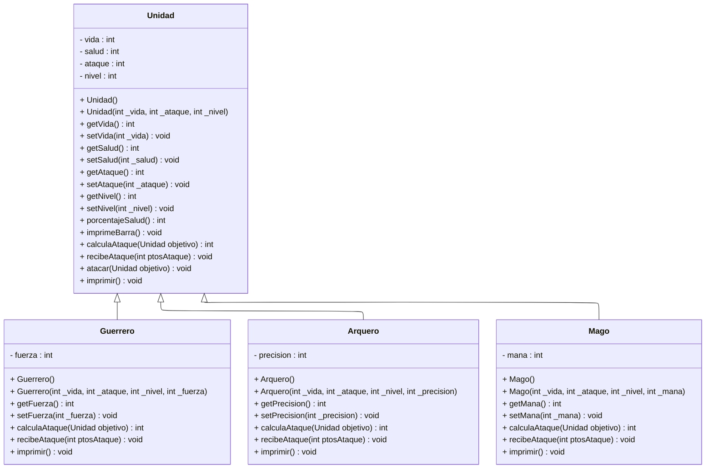

------------------------------- Reglas de combate -------------------------------

Guerrero:
    Atributo: `fuerza` (int). Representa su poder físico bruto.
    Ataque (`calculaAtaque`): Calcula el ataque base de la clase `Unidad` y le suma directamente la mitad de su `fuerza`.
    Defensa (`recibeAtaque`): Su armadura pesada le permite mitigar daño. Reduce el daño recibido en una cantidad igual a `fuerza / 4`.

Arquero:
    Atributo: `precision` (int, 0 a 100). Representa su probabilidad de acierto crítico.
    Ataque (`calculaAtaque`): Calcula el ataque base. Luego, tira un dado de 1 a 100. Si el número es menor o igual a su `precision`, asesta un "Tiro Crítico", multiplicando el daño total x1.5.
    Defensa (`recibeAtaque`): Tira un dado de 1 a 100. Si el número es menor a `precision / 2`, esquiva ágilmente el ataque y reduce el daño recibido a la mitad. Si falla, recibe el daño completo.

Mago:
    Atributo: `mana` (int). Energía mágica disponible.
    Ataque (`calculaAtaque`): Si tiene al menos 20 de maná, lanza un hechizo potente: duplica el ataque base calculado por `Unidad` y consume 20 de maná. Si tiene menos de 20 de maná, está exhausto y solo hace la mitad del daño base, pero recupera 10 de maná.
    Defensa (`recibeAtaque`): Escudo de maná. Si recibe daño y su nivel es mayor a 2, gasta 10 de maná para crear una barrera que absorbe un 30% del daño entrante. Si no tiene maná o nivel suficiente, recibe el impacto completo.